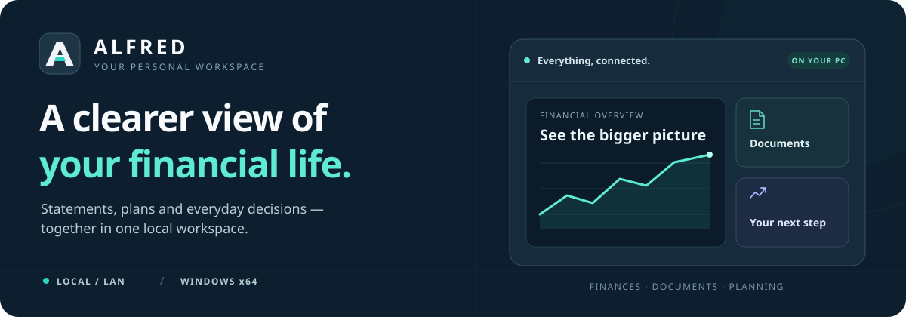

<p align="center">
  
</p>

<p align="center">
  <strong>Understand your money. Organize your documents. Plan what comes next.</strong><br>
  A personal finance workspace that runs on your Windows PC, with a browser interface and background jobs included.
</p>

<p align="center">
  <a href="https://github.com/sourabh48/alfred_ai/releases/download/v1.0.0-preview.1/ALFRED-Setup.exe"></a>
  &nbsp;
  <a href="https://github.com/sourabh48/alfred_ai/releases/download/v1.0.0-preview.1/ALFRED-Windows-x64.zip"></a>
</p>

<p align="center">
  <a href="#features">Features</a> ·
  <a href="#install-for-users">Install for users</a> ·
  <a href="#set-up-for-developers">Set up for developers</a> ·
  <a href="#verification-status">Verification</a> ·
  <a href="#documentation">Documentation</a>
</p>

<p align="center">
  <strong>Windows x64</strong> &nbsp; / &nbsp; <strong>Local or LAN hosting</strong> &nbsp; / &nbsp; <strong>Python included in downloads</strong>
</p>

---

## Features

<table>
  <tr>
    <td width="50%">
      <h3>💳 See your financial picture</h3>
      Import statements, review transactions, track spending and budgets, and understand cash flow and net worth.
    </td>
    <td width="50%">
      <h3>📄 Bring documents together</h3>
      Upload statements, credit reports, loan documents and other supported files. Review uncertain extraction and correct it in the document center.
    </td>
  </tr>
  <tr>
    <td>
      <h3>📊 Keep plans connected</h3>
      Track loans, repayments and investments alongside your everyday finances. Use career and vehicle workspaces for related planning.
    </td>
    <td>
      <h3>🤝 Share with consent</h3>
      Link consenting family accounts with a link code. Manage linked members and use <strong>Remove my data</strong> from Settings.
    </td>
  </tr>
  <tr>
    <td>
      <h3>🖥️ Run it on your own PC</h3>
      Open ALFRED from a desktop shortcut. The Windows package includes the web server, Python, local database, OCR runtime and web assets.
    </td>
    <td>
      <h3>⚙️ Keep work moving</h3>
      Background jobs handle scheduled refresh, cleanup and eligible training. Queued work survives restarts; interrupted imports and training stay available for review.
    </td>
  </tr>
</table>

ALFRED uses **Django + Waitress + Huey + SQLite** for its native Windows runtime.
Your data stays in your chosen local folder. Live external sources and configured
integrations need internet access; the interface assets and OCR engines are bundled.

## Install for users

**Choose this route to use ALFRED without setting up a development environment.**
You need a Windows x64 PC and a browser. Python, pip, Docker, PostgreSQL and Redis
do not need to be installed separately.

### 1. Download

| Download | Best for | Approximate size |
| --- | --- | --- |
| **[Windows installer](https://github.com/sourabh48/alfred_ai/releases/download/v1.0.0-preview.1/ALFRED-Setup.exe)** | Desktop and Start menu shortcuts, plus an uninstaller | 485 MB |
| **[Portable ZIP](https://github.com/sourabh48/alfred_ai/releases/download/v1.0.0-preview.1/ALFRED-Windows-x64.zip)** | Running from an extracted program folder | 542 MB |
| [SHA-256 checksums](https://github.com/sourabh48/alfred_ai/releases/download/v1.0.0-preview.1/SHA256SUMS.txt) | Checking the downloaded files | < 1 KB |

The current download is **v1.0.0-preview.1**, containing the Windows build verified
on 26–27 September 2026. See the [release notes](https://github.com/sourabh48/alfred_ai/releases/tag/v1.0.0-preview.1)
and [remaining acceptance checks](#verification-status). This preview installer
is not digitally signed; checksums are provided with the release.

### 2. Install and open

1. Run **ALFRED-Setup.exe** and complete setup. Installation is for your Windows
   account; administrator access is not required.
2. Open **ALFRED** from the desktop or Start menu. Wait for the launcher to open
   your browser.
3. Create your account, or sign in to an existing account in that data folder.
   Start with a statement upload or enter your financial details.

The browser normally opens at `http://127.0.0.1:8000/`. ALFRED selects another
port if needed; use the launcher to open the correct address.

<details>
<summary><strong>Using the portable ZIP instead</strong></summary>

Extract the **entire ZIP**, open the `ALFRED` folder, and double-click
**ALFRED Launcher.exe** or **Start ALFRED.cmd**. Keep `_internal` and both
executables together. Run it from the extracted folder, not from inside the ZIP.

Portable describes the program folder. By default, its data is still stored in
`%LOCALAPPDATA%\ALFRED`, just like the installed app.

</details>

<details>
<summary><strong>Check a download's SHA-256 checksum</strong></summary>

Download [SHA256SUMS.txt](https://github.com/sourabh48/alfred_ai/releases/download/v1.0.0-preview.1/SHA256SUMS.txt)
from the same release. In PowerShell, open the folder containing the installer:

```powershell
Get-FileHash .\ALFRED-Setup.exe -Algorithm SHA256
```

Compare the returned hash with the installer entry in `SHA256SUMS.txt`.
For the ZIP, replace the filename with `ALFRED-Windows-x64.zip`.

</details>

### 3. Stop, update or uninstall

- **Stop:** use **Stop ALFRED** in the Start menu, or **Stop ALFRED.cmd** in the
  portable folder. Closing the browser leaves background jobs running.
- **Update:** keep a backup, then run the newer installer or replace the portable
  program folder. The separate data folder is retained.
- **Uninstall:** choose **Uninstall ALFRED** in the Start menu or Windows
  **Settings → Apps**. The installed folder also includes **Uninstall ALFRED.cmd**.
  Saved accounts, documents, settings and models are retained.

See the [Windows package guide](docs/WINDOWS_PACKAGE.md) for troubleshooting and
the [startup guide](docs/NATIVE_WINDOWS.md#automatic-startup-after-windows-sign-in)
for optional startup after Windows sign-in. Scheduled work runs while the PC
and ALFRED are on.

## Set up for developers

**Choose this route to edit the code, run tests or build your own package.**
Use Git and **Python 3.12**, the currently tested development version. Run these
commands in PowerShell:

```powershell
git clone https://github.com/sourabh48/alfred_ai.git
cd alfred_ai

py -3.12 -m venv .venv
.\.venv\Scripts\python.exe -m pip install -r requirements.txt
.\.venv\Scripts\python.exe alfred_native.py start
```

The native launcher creates local configuration, applies migrations, prepares
static files and starts the server, worker and scheduler. No separate database
or queue service is needed. Keep an existing configured `.venv` when continuing
work on a checkout. Runtime secrets belong in untracked files such as
`config/local.env`.

```powershell
# Inspect or stop the source-based runtime
.\.venv\Scripts\python.exe alfred_native.py status
.\.venv\Scripts\python.exe alfred_native.py stop

# Run backend checks; browser workflows are run separately
$env:ALFRED_LOCAL_RUNTIME = 'true'
$env:ALFRED_AUTO_TRAIN_ON_STARTUP = 'false'
$env:ALFRED_RUN_BROWSER_TESTS = 'false'
.\.venv\Scripts\python.exe manage.py check
.\.venv\Scripts\python.exe manage.py test --noinput
```

Use a disposable checkout or data folder for integration tests. The
[development guide](docs/DEVELOPMENT.md) covers browser tests, diagnostics and
the Django development server. The [build guide](docs/WINDOWS_PACKAGE.md#build-the-same-release)
covers the standalone package and installer.

<details>
<summary><strong>Continuing an existing Windows checkout</strong></summary>

Double-click **ALFRED.lnk** or **Start ALFRED.cmd** when a packaged launcher is
available. It uses that checkout's existing data. Use **Stop ALFRED.cmd** to stop
it and **Enable ALFRED startup.cmd** to opt into quiet startup after sign-in.

The checkout's data and `%LOCALAPPDATA%\ALFRED` are separate. Installing a release
does not automatically import accounts or uploads from your development folder.

</details>

## Your data and recovery

| How you run ALFRED | Default data location |
| --- | --- |
| Windows installer or portable package | `%LOCALAPPDATA%\ALFRED` |
| Source checkout | The repository folder |

Back up the **database, uploads, models and private configuration together**.
Follow the [backup and restore guide](docs/NATIVE_WINDOWS.md#backup-and-restore)
before moving data between machines or installations. The downloads exclude the
developer's accounts, uploads and credentials.

Queued jobs survive restart. Interrupted maintenance can retry; interrupted
imports and training remain available for review. See
[data privacy and storage](docs/DATA_PRIVACY_AND_STORAGE.md) for the full policy.
Local-only access is the default; LAN access is a separate configuration decision.

## Verification status

**Recorded Windows verification, 26–27 September 2026.** These are completed
checks within the scope of the linked reports, not a claim of universal accuracy.

| Check | Recorded result |
| --- | --- |
| Backend regression suite | **407 passed**; browser cases run separately |
| Chrome browser workflows | **9 passed**, zero skips |
| Installer lifecycle | **6 passed**, including upgrade retention and uninstall |
| Packaged native runtime | **23 checks passed** |
| Concurrent local usage | **24-user test passed** |
| Observation and supervisor logic | **16 focused tests passed** |
| OCR, backup/restore, mobile layouts and automated accessibility | Passed within the documented test scope |

[Release verification](docs/WINDOWS_PACKAGE_VERIFICATION_20260927.md) ·
[Native runtime evidence](docs/WINDOWS_PACKAGE_VERIFICATION_20260926.md) ·
[Completion audit](docs/COMPLETION_AUDIT.md)

Still open: installation and reboot on a clean second Windows PC, a completed
continuous observation of scheduled jobs, manual screen-reader testing, heavier
real usage, and accuracy checks against independently reviewed documents and
outcomes. Model fitting alone does not establish accuracy. Optional LAN access
and live email/bureau integrations require their own configuration and validation.

The checkout includes [verification startup controls](docs/NATIVE_WINDOWS.md#verification-across-windows-sign-ins)
that retain interrupted reports and begin a fresh observation after sign-in.
Starting an observation does not count as passing it.

## Documentation

| I want to… | Read this |
| --- | --- |
| Install, update or uninstall | [Windows package guide](docs/WINDOWS_PACKAGE.md) |
| Configure startup, schedules or recovery | [Native Windows guide](docs/NATIVE_WINDOWS.md) |
| Develop, test or build | [Development guide](docs/DEVELOPMENT.md) |
| Test a fresh Windows PC | [Windows acceptance checklist](docs/WINDOWS_ACCEPTANCE.md) |
| Understand data handling | [Privacy and storage](docs/DATA_PRIVACY_AND_STORAGE.md) |
| Understand the system and planned work | [Architecture](docs/ARCHITECTURE.md) · [Future scope](docs/FUTURE_SCOPE.md) |
| Review completion and cleanup records | [Completion audit](docs/COMPLETION_AUDIT.md) · [Release verification](docs/WINDOWS_PACKAGE_VERIFICATION_20260927.md) |
| Use the optional container runtime | [Local Docker Compose guide](docs/LOCAL_HOSTING.md) |

Docker/PostgreSQL/Redis/Celery is an optional runtime. The native Windows app
uses Waitress, Huey and SQLite. Public/cloud deployment is outside the current scope.

---

<p align="center">
  <strong>ALFRED</strong><br>
  Your finances and documents, together.<br><br>
  <a href="https://github.com/sourabh48/alfred_ai/releases/tag/v1.0.0-preview.1">Download the Windows preview</a> ·
  <a href="https://github.com/sourabh48/alfred_ai/issues">Report an issue</a> ·
  <a href="#features">Back to features ↑</a>
</p>
