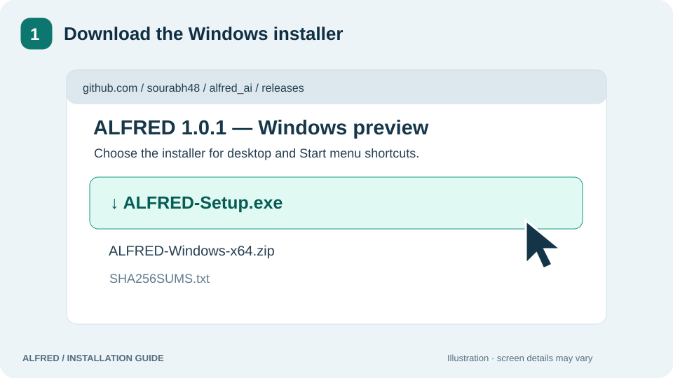
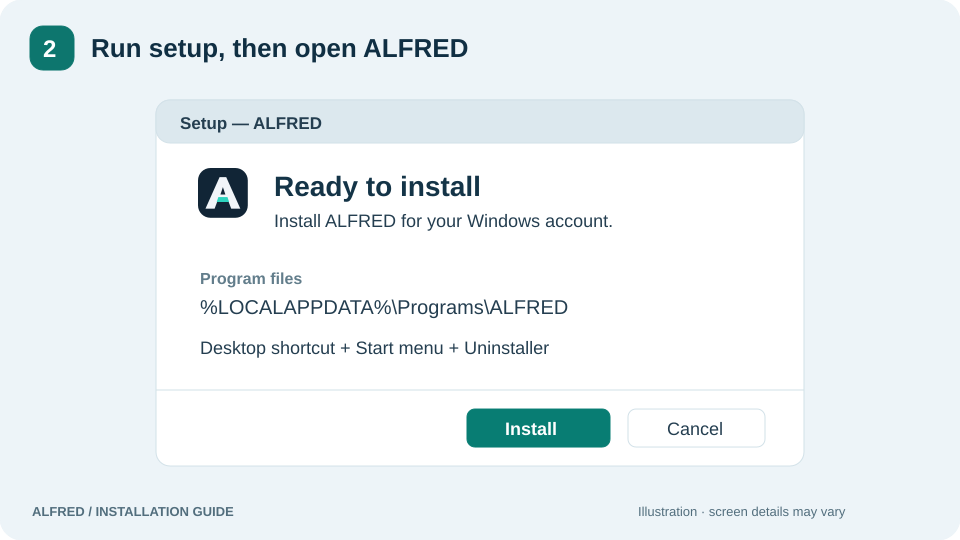
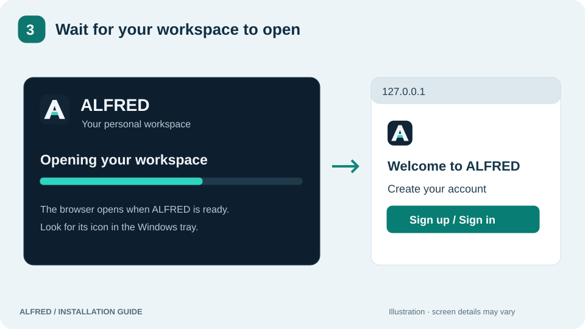
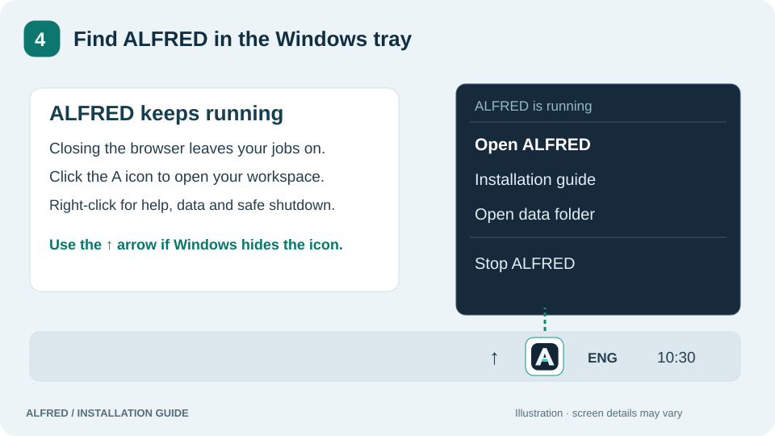

# Install and use Alfred - Finance Assistant

**[Open this guide as a website](https://sourabh48.github.io/alfred_ai/guide/)** · A product of Life on our Trails

[← Project overview](../README.md) · [Windows downloads](https://github.com/sourabh48/alfred_ai/releases/tag/v1.1.0-preview.1) · [Developer setup](DEVELOPMENT.md)

Use this guide to install the Windows x64 application. Python and dependencies
are included. The images below are illustrated instructions, not screenshots;
Windows and setup screens can vary.

## 1. Download

Download **[ALFRED-Setup.exe](https://github.com/sourabh48/alfred_ai/releases/download/v1.1.0-preview.1/ALFRED-Setup.exe)**.
For portable use, choose the ZIP and extract it completely. Checksums are on the
release page. This preview installer is not digitally signed.

## 2. Install

Run the installer and follow setup. Installation is for your Windows account;
administrator access is not required. ALFRED adds desktop and Start menu
shortcuts and an uninstaller.

## 3. Launch

Open **ALFRED** from the desktop or Start menu, then create an account or sign in
when the browser opens. In the portable folder, run **ALFRED Launcher.exe**.
Keep `_internal` and both executables together.

The usual address is `http://127.0.0.1:8000/`. Use the launcher to find the correct
address if ALFRED selected another port.

## 4. Use the tray icon

The **A icon** remains in the Windows notification area while ALFRED runs.
If Windows hides it, open the **↑ arrow** near the clock. Windows taskbar settings
let you choose which icons stay visible.

| Tray action | What it does |
| --- | --- |
| **Open ALFRED**, or click the icon | Opens the correct browser address |
| **Installation guide** | Opens the bundled illustrated guide offline |
| **Open data folder** | Opens this runtime's selected data folder |
| **Stop ALFRED** | Finishes active work and shuts down; the icon disappears afterward |

Closing the browser leaves background jobs running. The icon also appears when
ALFRED starts quietly after Windows sign-in.

## Update, uninstall and keep your data

Installed and portable copies use `%LOCALAPPDATA%\ALFRED` by default. Source
checkouts use their repository folder. Installing a release does not import
development data automatically.

Back up the database, uploads, models and private configuration together before
moving data or updating. Run a newer installer to update; for portable use,
stop ALFRED and replace its program folder. Uninstall through the Start menu,
Windows Settings → Apps, or **Uninstall ALFRED.cmd**. Saved data is retained.

[Backup and restore](NATIVE_WINDOWS.md#backup-and-restore) ·
[Full package guide](WINDOWS_PACKAGE.md) · [Privacy and storage](DATA_PRIVACY_AND_STORAGE.md)

## Developer installation

Developers use **Git and Python 3.12** to create a virtual environment, install
requirements and start `alfred_native.py`. Follow the separate
[developer setup instructions](../README.md#set-up-for-developers) and
[testing/build guide](DEVELOPMENT.md). These steps are unnecessary for the
installer and portable downloads.
